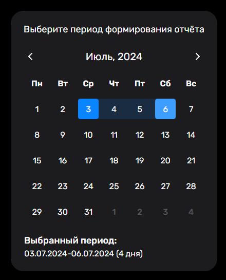
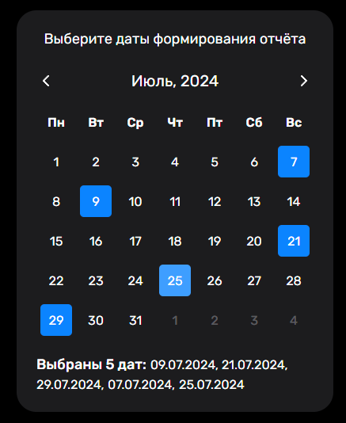

# Календарь

Реализация календаря, имеющего различные режимы выбора дат:
- Конкретная дата
- Несколько конкретных дат
- Один период времени
- Несколько периодов времени

## Стек технологий:
- TypeScript
- Vue.js
- Pinia
- SCSS

## Скриншоты календаря

#### Режим с одним периодом времени

#### Режим с несколькими датами